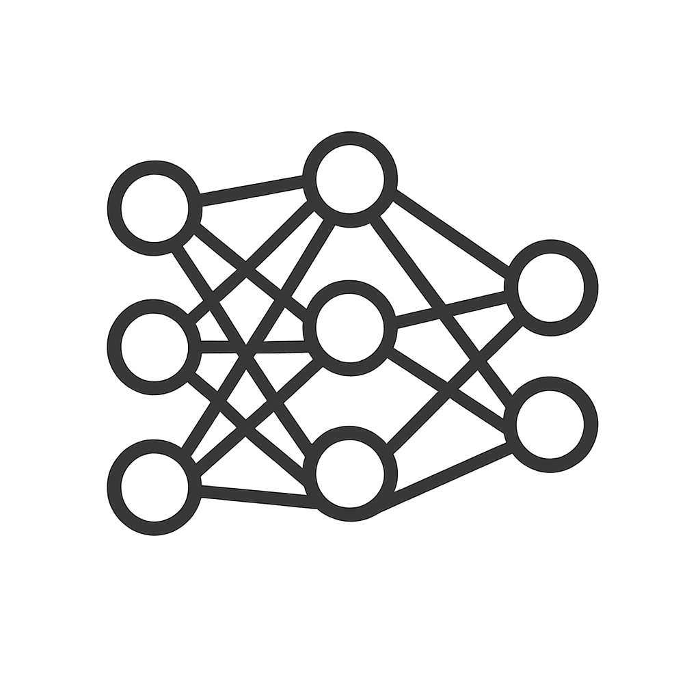
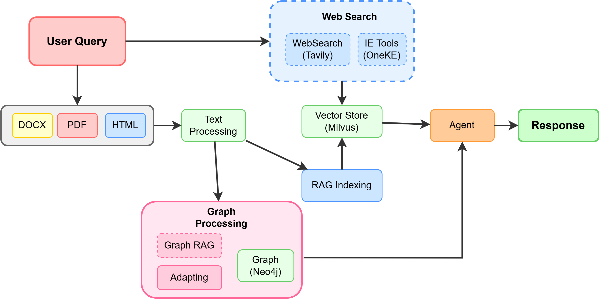
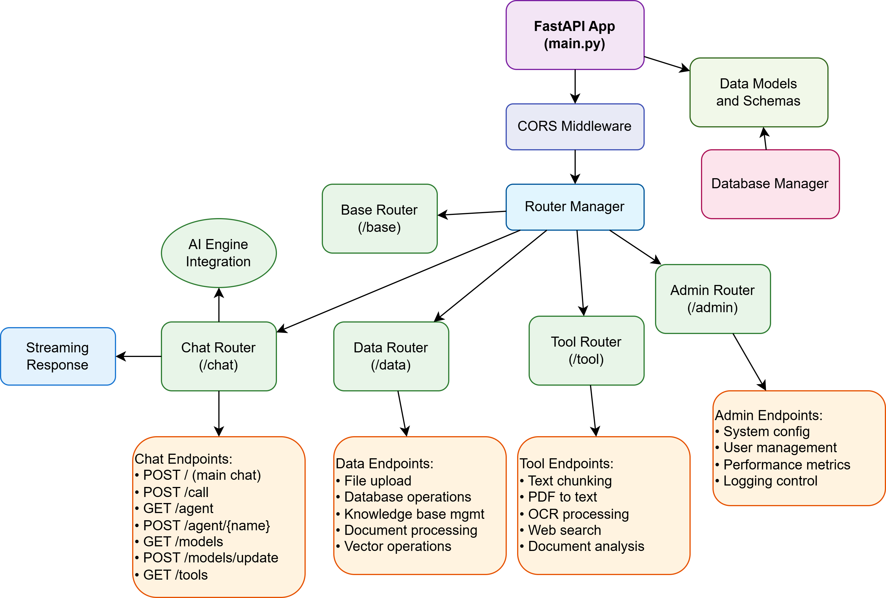
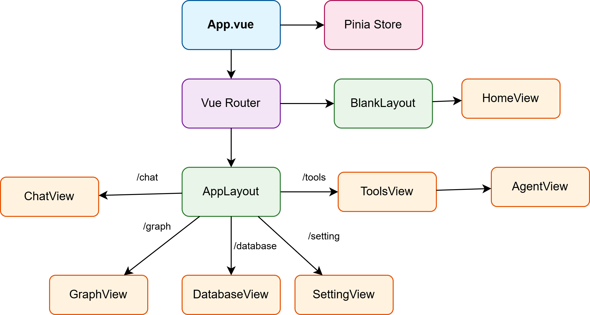
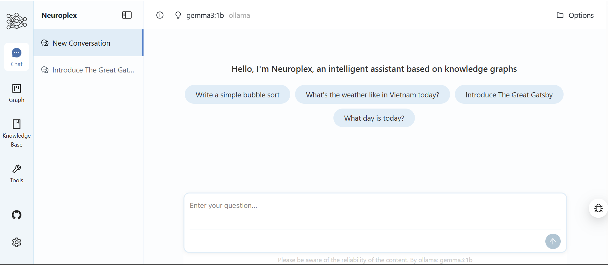

<h1 align="center">
  
  <br>
  Neuroplex - Advanced AI Agent Platform
</h1>
<div align="center">


</div>

## Project Overview

Neuroplex is an advanced AI Agent Platform that revolutionizes the way we interact with language models and neural networks. Built on a modern tech stack combining **FastAPI + Vue.js + AI Engine + Neo4j + Milvus**, it provides a comprehensive solution for AI-powered knowledge management and intelligent question-answering.

**Core Features:**

- **Multi-Model AI Support**: Compatible with OpenAI, Anthropic, Google, local Ollama deployments, and major LLM providers. Simply configure the corresponding `API_KEY` to use.
- **Advanced Knowledge Management**: Supports multiple document formats (PDF, TXT, MD, Docx, images with OCR), URL-based file adding, and intelligent web search capabilities.
- **Knowledge Graph Integration**: Neo4j-based knowledge graph with relationship analysis and graph traversal capabilities.
- **Vector Search Engine**: Milvus-powered semantic search with advanced embedding and retrieval mechanisms.
- **Agent Extensions**: Modular agent system suitable for custom development and integration.
- **Production Ready**: Full Docker containerization with monitoring, health checks, and scalable architecture.



## System Architecture

The system consists of three main components:

### AI Engine

- **Core Processing**: Multi-model AI integration and processing engine
- **Knowledge Database**: Vector storage and semantic search with Milvus
- **Graph Database**: Relationship mapping and graph traversal with Neo4j
- **Tools Integration**: Web search, OCR, and external service connectors
- **Agent Framework**: Modular agent system for custom implementations

### Backend (FastAPI)

- **RESTful APIs**: Complete API endpoints for all system functionalities
- **Authentication**: Secure API key management and access control
- **Real-time Processing**: Async processing with health monitoring
- **Data Management**: Integration with databases and external services

### Frontend (Vue.js)

- **Modern UI**: Vue.js 3+ with Ant Design components
- **Interactive Visualizations**: D3.js and ECharts for data representation
- **Real-time Updates**: WebSocket support for live interactions
- **Responsive Design**: Mobile-friendly interface with modern UX



*The intuitive chat interface with sidebar navigation for different modules including Chat, Graph visualization, Knowledge Base management, and Tools integration.*

## Quick Start

### Environment Configuration

Before starting, you need to provide API keys from service providers and place them in the `ai_engine/.env` file (create based on [ai_engine/.env.example](ai_engine/.env.example)).

**Required Configuration:**
```bash
# Essential AI Model APIs (choose at least one)
OPENAI_API_KEY=sk-your-openai-key
ANTHROPIC_API_KEY=sk-ant-your-anthropic-key
QWEN_API_KEY=sk-your-qwen-key
DEEPSEEK_API_KEY=sk-your-deepseek-key

# Optional Services
TAVILY_API_KEY=tvly-your-tavily-key  # Web search functionality
MODEL_DIR=/path/to/local/models       # Local model storage
```

> **Tip**: You can start with free API keys from providers like DeepSeek or use local models with Ollama.

### Starting the Service

> Make sure you have installed [Docker](https://docs.docker.com/engine/install/) and [Docker Compose](https://docs.docker.com/compose/install/)

**Production Environment:**
```bash
cd docker
docker-compose up -d
```

**Development Environment** (with hot-reload):
```bash
cd docker
docker-compose -f docker-compose.dev.yml up -d
```

After successful startup, you'll see the following containers:
```
[+] Running 7/7
 ✔ Network app-network              Created
 ✔ Container ollama                 Started
 ✔ Container graph-dev              Started
 ✔ Container milvus-etcd            Started
 ✔ Container milvus-minio           Started
 ✔ Container milvus-standalone      Started
 ✔ Container neuroplex-backend      Started
 ✔ Container neuroplex-frontend     Started
```

**Access Points:**
- 🌐 **Frontend**: http://localhost:3000 (production) / http://localhost:5173 (development)
- 🔧 **Backend API**: http://localhost:5000
- 📊 **Neo4j Browser**: http://localhost:7474 (neo4j/neuroplex-12345678)
- 💾 **Minio Console**: http://localhost:9001 (minioadmin/minioadmin)
- 🦙 **Ollama**: http://localhost:11434

### Service Management

**Stop services:**
```bash
docker-compose down
```

**View logs:**
```bash
docker-compose logs -f backend    # Backend logs
docker-compose logs -f frontend   # Frontend logs
docker-compose logs -f graph      # Neo4j logs
```

**Rebuild containers:**
```bash
docker-compose up -d --build
```

## AI Model Support

### 1. Conversation Models

This project supports models called via API and local models through Ollama integration.

| Model Provider    | Default Model              | Configuration Item  | Status |
|:------------------|:---------------------------|:-------------------|:-------|
| `openai`         | `gpt-4o`                   | `OPENAI_API_KEY`   | ✅ |
| `anthropic`      | `claude-3-sonnet`          | `ANTHROPIC_API_KEY`| ✅ |
| `deepseek`       | `deepseek-chat`            | `DEEPSEEK_API_KEY` | ✅ |
| `qwen`           | `qwen-plus`                | `QWEN_API_KEY`     | ✅ |
| `ollama` (local) | `llama3.1`, `qwen2`        | Local deployment   | ✅ |

#### Adding Local Models (Ollama)

```bash
# Pull models to Ollama
docker exec -it ollama ollama pull llama3.1
docker exec -it ollama ollama pull qwen2:7b
docker exec -it ollama ollama pull codellama

# Models are automatically available in the system
```

### 2. Embedding & Rerank Models

The system supports various embedding models for vector search:

- **SiliconFlow** (recommended): `bge-m3` (free)
- **Local Models**: `FlagEmbedding/bge-m3`
- **OpenAI**: `text-embedding-ada-002`
- **Custom Models**: Configure in `ai_engine/configs/`

## Knowledge Base Features

### Supported Document Types
- **PDF**: Full text extraction with layout preservation
- **Text Files**: TXT, Markdown with metadata
- **Office Documents**: Docx with formatting
- **Images**: OCR with EasyOCR and PaddleOCR
- **Web Content**: URL-based content extraction

### Document Processing Pipeline
1. **Upload & Parsing**: Multi-format document parsing
2. **Chunking**: Intelligent text segmentation
3. **Embedding**: Vector representation generation
4. **Indexing**: Milvus vector database storage
5. **Retrieval**: Semantic search and ranking

## Knowledge Graph Features

### Graph Database (Neo4j)
- **Entity Recognition**: Automatic entity extraction
- **Relationship Mapping**: Complex relationship modeling
- **Graph Traversal**: Advanced pathfinding algorithms
- **Visual Analytics**: Interactive graph visualization

### Graph Data Format
Support for structured knowledge in JSONL format:
```json
{"h": "Beijing", "t": "China", "r": "capital"}
{"h": "Python", "t": "Programming Language", "r": "is_a"}
{"h": "FastAPI", "t": "Python", "r": "built_with"}
```

### Neo4j Access
- **URL**: http://localhost:7474
- **Username**: `neo4j`
- **Password**: `neuroplex-12345678`

You can import existing Neo4j databases by updating the connection settings in `docker/docker-compose.yml`.

## Advanced Configuration

### Environment Variables

**AI Engine Configuration:**
```bash
# Database Connections
NEO4J_URI=bolt://graph:7687
MILVUS_HOST=standalone
MILVUS_PORT=19530
OLLAMA_BASE_URL=http://ollama:11434

# Processing Settings
PYTHONPATH=/app
ENVIRONMENT=production
```

**Frontend Configuration:**
```bash
VITE_API_BASE_URL=http://localhost:5000
NODE_ENV=production
```

### Custom Agent Development

Create custom agents by extending the base agent class:

```python
from ai_engine.agents.base import BaseAgent

class CustomAgent(BaseAgent):
    def process(self, query: str) -> str:
        # Your custom logic here
        return response
```

## Docker Architecture

### Production Deployment
- **Multi-stage builds** for optimized images
- **Health checks** for all services
- **Volume persistence** for data
- **Network isolation** and service discovery

### Development Environment
- **Hot-reload** for both frontend and backend
- **Volume mounting** for live code changes
- **Debug configurations** enabled

## Development Guide

### Prerequisites
- Docker & Docker Compose
- 8GB+ RAM recommended
- 20GB+ storage space

### Development Workflow
1. Clone the repository
2. Configure environment variables
3. Start development environment
4. Access services with hot-reload enabled

### Testing
```bash
# Backend tests
cd backend && python -m pytest

# Frontend linting
cd frontend && npm run lint

# Health checks
curl http://localhost:5000/health
```

## Performance & Monitoring

### Health Monitoring
- **Backend**: `/health` endpoint
- **Database health checks**: Automated monitoring
- **Container health**: Built-in Docker health checks
- **Resource monitoring**: CPU, memory, storage tracking

### Performance Optimization
- **Caching**: Nginx caching and compression
- **Database indexing**: Optimized queries
- **Async processing**: Non-blocking operations
- **Vector search**: Optimized similarity search

## Roadmap

- [ ] **WebSocket Integration**: Real-time communication
- [ ] **Multi-language Support**: Internationalization
- [ ] **Plugin System**: Custom tool integration
- [ ] **Cloud Deployment**: Kubernetes templates
- [ ] **Advanced Analytics**: Usage statistics and insights
- [ ] **Mobile Applications**: React Native apps

## Contributing

We welcome contributions! Please feel free to submit issues and enhancement requests.

### Development Setup
1. Fork the repository
2. Create a feature branch
3. Make your changes
4. Submit a pull request

## License

This project is licensed under the MIT License - see the [LICENSE](LICENSE) file for details.

## Acknowledgments

Thanks to all the amazing open-source projects that make Neuroplex possible:
- FastAPI, Vue.js, Neo4j, Milvus
- LlamaIndex, LangChain, Transformers
- All our contributors and the community

---

<div align="center">
  <strong>⭐ Star this repository if you find it helpful!</strong>
</div>